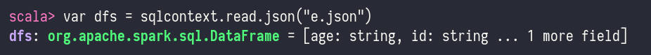
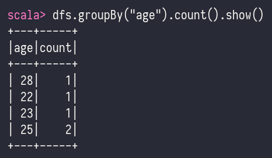
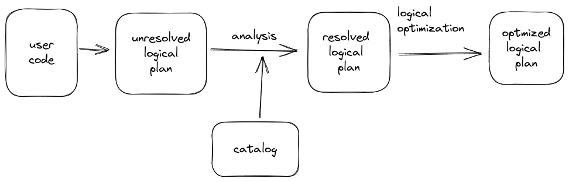

# Spark API

- api - application programming interfaces
    - helps to provide similar performance in all languages
- language API
    - scala
    - java
    - python
    - sql
    - r - spark

## SparkSession

- we can control spark application through a driver process called the `SparkSession`
- `SparkSession` instance is the way Spark executes user-defined manipulations across the clusters
- one to one correspondence between a `SparkSession` and a `SparkApplication`
- `SparkSession` object is available to the user, which is the entrance point to the spark code
- python, r that spark translates into code that it can ron on executor jvm

## Structured API overview

- The Structured APIs are a tool for manipulating all sorts of data, from unstructured log files to
  semi-structured CSV files and highly structured Parquet files.
- these api refers to three core types of distributed collection API's:
    - datasets
    - data frames
    - SQL tables views

- Spark has two notions of structured collections
    - DataFrames
    - Datasets
- Spark uses an engine called Catalyst that maintains its own type of information through the planning and
  processing of work
- In doing so, this opens up a wide variety of execution optimizations that make significant differences
- Spark types map directly to the different language APIs that spark maintains and there exist a lookup table
  for each of these in Scala, java ,python , sql, r
- Even if we use spark's structured APIs form python or R, the majority of manipulations will operate strickly on spark types, not python types

```scala
val df = spark.range(500).toDF("number")
df.select(df.col("number")+10)
```

```py
df = spark.range(500).toDF("number")
df.select(df["number"] + 10)
```

## Data Frames

- A DataFrame is a distributed collection of data, which is organized into named columns.
- Conceptually, it is equivalent to relational tables with good optimization techniques.
- A DataFrame can be constructed from an array of different sources such as
  Hive tables, Structured Data files, external databases, or existing RDDs.

### Features of data frame

- Ability to process the data in the size of Kilobytes to Petabytes on a single node cluster to large cluster.
- Supports different data formats (Avro, csv, elastic search, and Cassandra) and storage systems (HOFS, HIVE tables, mysql, etc).
- State of art optimization and code generation through the Spark SQL Catalyst optimizer (tree transformation framework).
- Can be easily integrated with all Big Data tools and frameworks via Spark-Core.
- Provides API for Python, Java, Scala, and R Programming.

### SQLContext

- SQLContext is a class and is used for initializing the functionalities of Spark SQL.
- SparkContext class object (sc) is required for initializing SALContext class object.
- The following command is used for initializing the SparkContext through spark-shell.
	- `spark-shell`
- By default, the SparkContext object is initialized with the name `sc` when the spark-shell starts.
- Use the following command to create `SQLContext`.
	- `scala> val sqlcontext = new org.apache.spark.sql.SQLContext(sc)`

`employee.json` - note that records are separated by line (it is not a normal json file)

```json
{"id": "1201", "name": "satish", "age": "25"}
{"id": "1201", "name": "krishna", "age": "25"}
{"id": "1201", "name": "amith", "age": "28"}
{"id": "1201", "name": "javed", "age": "22"}
{"id": "1201", "name": "ram", "age": "23"}
```

- Follow the steps given below to perform DataFrame operations
    - Read the JSON Document
        - First, we have to read the JSON document. Based on this, generate a DataFrame named (dfs).
        - Use the following command to read the JSON document named employee,json.
        - The data is shown as a table with the fields ~ id, name, and age.
        - `scala> val dfs = sqlcontext.read.json("employee.json")`
        - Output - The field names are taken automatically from employee.json.`
            - `dfs: org.apache.spark.sql.DataFrame = [age: string, id: string, name: string]`
        -   
    - Show the Data
        - If you want to see the data in the DataFrame, then use the following command.
        - `scala> df.show()`
        - Output - You can see the employee data in a tabular format.
        -   
    - Use printSchema Method
        - `scala> dfs.printSchema()`
        -   
    - use select method
        - `dfs.select("name").show()`
        -   
    - use filter
        - `dfs.filter(dfs("age") > 23).show()`
        -   
    - use groupby method
        - `dfs.groupBy("age").count().show()`
        -   

```scala
spark-shell // will create a sc variable itself
val sqlcontext = new org.apache.spark.sql.SQLContext(sc)

val dfs = sqlcontext.read.json("employee.json")

df.show()
dfs.printSchema()
dfs.select("name").show()
dfs.filter(dfs("age") > 23).show()
dfs.groupBy("age").count().show()
```

- A DataFrame is the most common Structured API and simply represents a table of data with rows and columns.
- This list that defines the columns and the types within those columns is called schema.
- The reason to distribute data is
    - the data is too large to fit on one machine
    - it will take long time to perform that computation on one machine

### Partitions

- To allow every executor to perform work in parallel, Spark breaks up the data into chunks called partitions.
- A partition is a collection of rows that sit on one physical machine in your cluster.
- A DataFrame's partitions represent how the data is physically distributed across the cluster of machines during execution.
- lf you have one partition, Spark will have a parallelism of only one, even if you have thousands of executors.
- If you have many partitions but only one executors, Spark will still have a parallelism of only one because there is only one computation resource.

### Transformations

- core data structure is immutable, meaning they cannot be changed after they're created
- to use data it is transformed
- two types of transforamtions
	- those that specify narrow dependencies
	- those that sepecify wide dependencies

## Datasets

- Datasets in Apache Spark are an extension of DataFrame API.
- It provides type-safe, object-oriented programming interface.
- Dataset takes advantage of Spark's Catalyst optimizer by exposing
  expressions and data fields to a query planner.
- Spark introduced Dataset in Spark 1.6 release.

### Features

- It efficiently processes structured and unstructured data.
- It represents data in the form of JVM objects of row or a collection of row object, which
  is represented in tabular forms through encoders.
- It allows to convert an existing RDD and DataFrames into Datasets.
- It provides compile-time type safety.
- Dataset APIs is currently only available in Scala and Java.
- In Dataset it is faster to perform aggregation operation on plenty of data sets.

## Columns

## Rows

## Spark Types

## Structured API Execution

Overview:

1. Write `DataFrame`/`Dataset`/`SQL Code`.
2. If valid code, Spark converts this to a Logical Plan.
3. Spark transforms this Logical Plan to a Physical Plan, checking for optimizations along the way.
4. Spark then executes this Physical Plan (RDD manipulations) on the cluster.

### Logical Planning

- The logical plan only represents a set of abstract transformations that do not refer to executors or drivers, it’s purely to convert the user’s set of expressions into the most optimized version.
- It does this by converting user code into an unresolved logical plan.
- This plan is unresolved because although your code might be valid, the tables or columns that it refers to might or might not exist.
- Spark uses the catalog, a repository of all table and DataFrame information, to resolve columns and tables in the analyzer.
- The analyzer might reject the unresolved logical plan if the required table or column name does not exist in the catalog.
- If the analyzer can resolve it, the result is passed through the Catalyst Optimizer, a collection of rules that attempt to optimize the logical plan by pushing down predicates or selections.
- Packages can extend the Catalyst to include their own rules for domain-specific optimizations.




### Physical Planning

- After successfully creating an optimized logical plan, Spark then begins the physical planning process.
- The physical plan, often called a Spark plan, specifies how the logical plan will execute on the cluster by generating different physical execution strategies and comparing them through a cost model.
- Physical planning results in a series of RDDs and transformations.
- This result is why you might have heard Spark referred to as a compiler—it takes queries in DataFrames, Datasets, and SQL and compiles them into RDD transformations.

> NOTE: An example of the cost comparison might be choosing how to perform a given join by looking at the physical attributes of a given table (how big the table is or how big its partitions are).


### Execution

- Upon selecting a physical plan, Spark runs all of this code over RDDs, the lower-level programming interface of Spark.
- Spark performs further optimizations at runtime, generating native Java bytecode that can remove entire tasks or stages during execution.
- Finally, the result is returned to the user.